# cos-design：从视觉 Demo 到可发布组件库的完整实践

> 本文基于 **cos-design v2.2.0** 编写。相比简短的 README，这篇文章更系统地介绍项目背景、技术架构、使用规则、组件能力、适用场景与工程化方案，并附上本地 Playground 的真实截图。

---

## 一、写在前面：为什么会有这个项目？

很多前端项目里都存在这样一个空白区：  
业务表单、表格、弹窗已经足够成熟，但一旦需要做一些“更有氛围感”的东西，比如：

- 活动页的转盘抽奖
- 登录页或欢迎页的粒子背景
- 营销场景下的烟花庆祝效果
- 游戏风格的回城传送特效
- 更偏创意表达的霓虹灯文字、打字机动画

开发者往往只能：

1. 临时找一段零散 Demo 改造
2. 自己从零写 Canvas 动画
3. 在多个页面中复制难以维护的样式代码

**cos-design** 就是在这种需求下逐渐形成的。它不是传统意义上的“后台组件库”，而是一个更偏**视觉表达**和**交互氛围**的 React 组件集合。你可以把它理解为：

> 一个适合放进活动页、展示页、作品集、技术 Demo、品牌页面里的“视觉特效组件库”。

项目地址：[github.com/jiaxiantao/cos-design](https://github.com/jiaxiantao/cos-design)  
npm 包：[npmjs.com/package/cos-design](https://www.npmjs.com/package/cos-design)

---

## 二、项目定位：它适合什么，不适合什么？

在介绍技术细节之前，先明确这个库的边界。

### 适合的场景

- 营销活动页、抽奖页
- 品牌官网、Landing Page
- 创意展示页、个人作品集
- 游戏化界面、节日祝福页
- 控制台、后台中的视觉增强模块

### 不适合的场景

- 以表单/数据录入为主的企业级业务系统核心区
- 对首屏极度敏感、完全不需要视觉特效的页面
- 需要完全无动画、极致静态稳定输出的纯文档站

换句话说，**cos-design 不是通用业务 UI 组件库的替代品**。它更像是对现有业务系统的一层“视觉强化插件”，用来增加品牌感、趣味性和展示效果。

---

## 三、项目现状与演进

从当前仓库状态来看，这个项目已经完成了几次重要升级：

### 1. 从 Webpack 迁移到 Vite

旧版本基于 Webpack 构建，现在已经迁移到：

- **Vite 8**
- **React 19**
- **TypeScript 5**
- **pnpm 9**

这意味着本地开发速度更快，组件库输出结构更清晰，也更适合继续扩展和维护。

### 2. 从单个 Demo 走向组件集合

项目早期更像是几个视觉效果 Demo 的集合；现在已经具备了更像“组件库”的基本结构：

- 独立组件目录
- 每个组件导出 Props 类型
- `dist/` 目录输出 ESM / CJS / `.d.ts`
- 本地 Playground 导航首页
- CI / Release 自动化工作流

### 3. 从“能跑”到“能发布”

项目已经具备：

- npm 发包能力
- GitHub Actions CI
- npm 自动发布流程
- `CHANGELOG.md`、`CONTRIBUTING.md` 等开源标准文件

这也是它和“随手写的特效 Demo”最大的区别之一。

---

## 四、技术栈与工程实现

### 1. 技术栈

| 类别     | 技术                                |
| -------- | ----------------------------------- |
| 框架     | React 19                            |
| 语言     | TypeScript 5                        |
| 构建工具 | Vite 8                              |
| 样式方案 | Less + CSS Modules                  |
| 包管理   | pnpm 9                              |
| 代码检查 | ESLint 9 Flat Config + Stylelint 17 |
| 类型产物 | `vite-plugin-dts`                   |
| CSS 注入 | `vite-plugin-lib-inject-css`        |

### 2. 为什么这样选？

#### React 19

使用 React 19 的好处在于：

- 类型系统更现代
- 生态依旧保持主流
- 能及时暴露旧写法中的潜在问题

例如本项目在升级 React 19 后，就顺手修复了 `Typewriter` 中 effect 内同步 setState 的写法问题。

#### Vite 8

对一个前端组件库来说，Vite 的优势非常明显：

- 启动快
- 热更新快
- 构建配置更轻
- 适合同时维护“库构建”和“本地预览页”

#### Less + CSS Modules

视觉型组件有大量样式细节和动画帧，CSS Modules 能有效避免命名冲突；Less 则让样式组织更灵活。

---

## 五、安装与使用规则

这一节非常重要。如果只想知道“怎么在项目里用”，看这里即可。

### 环境要求

- **Node.js >= 20**
- **React >= 18**
- 推荐使用 **Node 22**

### 安装

```bash
# pnpm（推荐）
pnpm add cos-design

# npm
npm install cos-design

# yarn
yarn add cos-design
```

### 最小示例

```tsx
import { CanvasClock, Fireworks, Turntable } from 'cos-design';

export default function App() {
  return (
    <div>
      <CanvasClock width={400} height={400} />
      <Fireworks width={800} height={500} />
      <Turntable onSpinEnd={(prize) => console.log(prize)} />
    </div>
  );
}
```

### 使用规则（建议你认真看完）

#### 规则 1：无需手动引入组件库 CSS

组件库已经通过 `vite-plugin-lib-inject-css` 处理了样式注入，所以**不要再额外 import 全量 CSS**：

```tsx
// ❌ 不需要
import 'cos-design/dist/index.css';
```

#### 规则 2：React / React DOM 由业务项目自行提供

它们在库中是 `peerDependencies`，这意味着：

- 你的业务项目自己安装 `react`
- 自己安装 `react-dom`
- 版本要求 `>= 18`

这样做可以避免组件库把 React 打包进产物，减少重复依赖和 bundle 体积。

#### 规则 3：优先按需引入

```tsx
import { NeonText } from 'cos-design';
```

比起整库使用，按需引入更利于 Tree Shaking，也更符合组件库的实际用法。

#### 规则 4：Canvas 组件适合客户端渲染

像 `CanvasClock`、`Fireworks`、`MatrixRain`、`ParticleNetwork` 这类组件依赖：

- `window`
- `canvas`
- `requestAnimationFrame`

如果你在 Next.js / Remix / SSR 环境中使用，建议：

- 动态导入
- 或仅在客户端挂载后渲染

例如：

```tsx
import dynamic from 'next/dynamic';

const Fireworks = dynamic(() => import('cos-design').then((m) => m.Fireworks), {
  ssr: false,
});
```

#### 规则 5：特效组件应控制使用密度

这类组件的目标是“提升页面氛围”，不是让每个区块都变成动画舞台。更推荐：

- 主页 Hero 区放一个强视觉组件
- 页面中部放一个 CTA 类互动按钮
- 抽奖、结果反馈等节点再叠加烟花 / 转盘

如果每个区块都上动态背景，视觉会互相抢戏。

#### 规则 6：Props 尽量显式传值

为了让行为更稳定，建议在业务接入时明确传入关键参数，比如：

```tsx
<Turntable spinDuration={5000} spinRounds={6} />
<MatrixRain width={1200} height={480} density={0.7} />
```

而不是完全依赖默认值。这样在后期调优时，参数更直观。

---

## 六、本地开发与预览

这个项目内置了一个不错的开发 Playground，可以直接预览全部组件。

### 克隆与启动

```bash
git clone git@github.com:jiaxiantao/cos-design.git
cd cos-design

# 推荐：使用 setup 脚本安装依赖
npm run setup

# 启动开发服务器
npx --yes pnpm@9 dev
```

浏览器访问 `http://localhost:4000`，进入首页后点击卡片即可查看各个演示页。

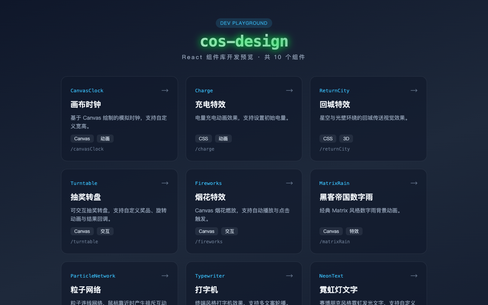

### 常用脚本

| 命令            | 说明                    |
| --------------- | ----------------------- |
| `npm run setup` | 安装依赖                |
| `pnpm dev`      | 启动 Playground         |
| `pnpm build`    | 构建组件库到 `dist/`    |
| `pnpm lint`     | 运行 ESLint + Stylelint |

### 当前组件导出清单

从源码导出入口可以看到，目前库对外暴露的组件包括：

- `CanvasClock`
- `Charge`
- `Fireworks`
- `MatrixRain`
- `NeonText`
- `ParticleNetwork`
- `ReturnCity`
- `Turntable`
- `Typewriter`
- `WaveButton`

同时也导出了每个组件对应的 Props 类型。

---

## 七、组件能力全景图

目前库里一共 **10 个**组件。为了更容易理解，可以把它们分成三类：

### 1. Canvas 动画类

- `CanvasClock`
- `Turntable`
- `Fireworks`
- `MatrixRain`
- `ParticleNetwork`

特点：

- 视觉表现力强
- 动态细节丰富
- 更适合 Hero 区、背景区或互动区

### 2. CSS / 视觉特效类

- `Charge`
- `ReturnCity`
- `NeonText`
- `WaveButton`

特点：

- 无需复杂绘图上下文
- 更容易嵌入现有页面结构
- 适合局部点缀

### 3. 文本 / 交互氛围类

- `Typewriter`

特点：

- 更轻量
- 更适合作为标题、副标题或终端风展示区

---

## 八、组件详解与截图展示

下面按组件逐个展开。相比简单列 Props，这里也会补充更适合的使用场景和接入建议。

---

### 1. CanvasClock — 画布时钟

基于 Canvas 绘制的模拟时钟，支持自定义尺寸，时针、分针、秒针实时运转。这个组件看起来简单，但很适合拿来做“时间感”相关的视觉区域，比如：

- 登录页背景角落装饰
- 时间主题活动页
- 技术展示页中的 Canvas Demo

```tsx
<CanvasClock width={400} height={400} />
```

| 属性     | 类型     | 默认值 | 说明     |
| -------- | -------- | ------ | -------- |
| `width`  | `number` | `400`  | 画布宽度 |
| `height` | `number` | `400`  | 画布高度 |

**使用建议：**

- 推荐保持宽高相等
- 适合浅色时钟主体 + 深色背景搭配
- 若放在窄容器中，建议通过外层容器控制布局，不要单纯缩放 canvas

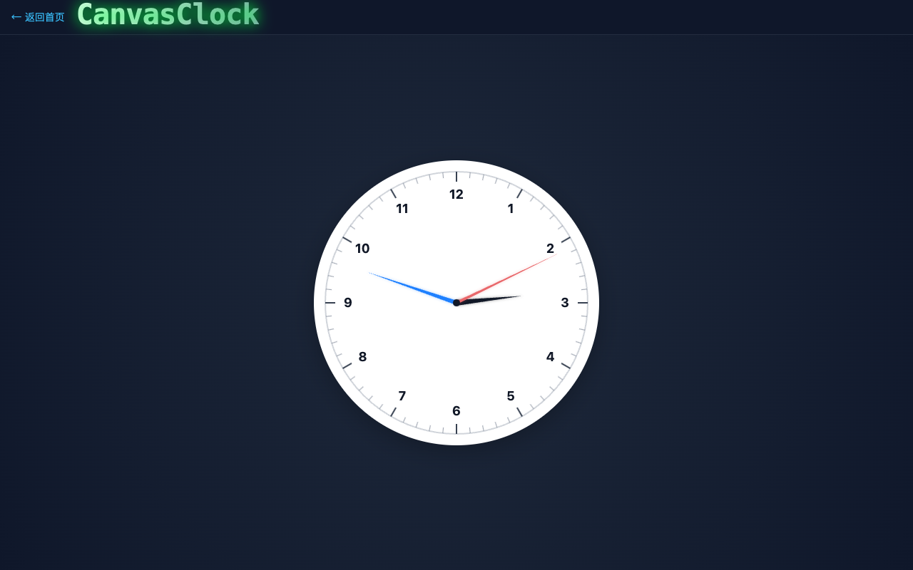

---

### 2. Charge — 充电特效

`Charge` 是一个非常有辨识度的“液态充电”组件，视觉上有点像液体、气泡、能量池三者叠加。

它适合：

- 进度加载页
- 电量状态展示
- AI / 数据处理中间态页面

```tsx
<Charge initQuantity={0} />
```

| 属性           | 类型     | 默认值 | 说明           |
| -------------- | -------- | ------ | -------------- |
| `initQuantity` | `number` | `0`    | 初始电量百分比 |

**使用建议：**

- 更适合单独作为一个屏幕级展示模块
- 背景建议使用纯黑或深色
- 若你需要“真实进度”，可考虑未来在此基础上扩展受控模式

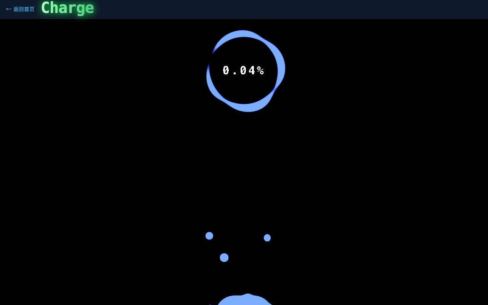

---

### 3. ReturnCity — 回城特效

这是一个很有“游戏 UI”味道的组件。星空、光柱、环状壁垒组合在一起，很容易让人联想到 MOBA 游戏中的回城或传送动作。

适合：

- 游戏活动页
- 元宇宙 / 科技感项目
- 页面对“召唤”“传送”“降临”等概念的表达

```tsx
<ReturnCity />
```

| 属性      | 类型     | 默认值 | 说明     |
| --------- | -------- | ------ | -------- |
| `shining` | `number` | -      | 预留属性 |

**使用建议：**

- 当前更偏全屏展示类组件
- 适合与标题、按钮叠加构成主视觉
- 如果后续做增强，可继续扩展亮度、光柱数量、颜色方案等参数

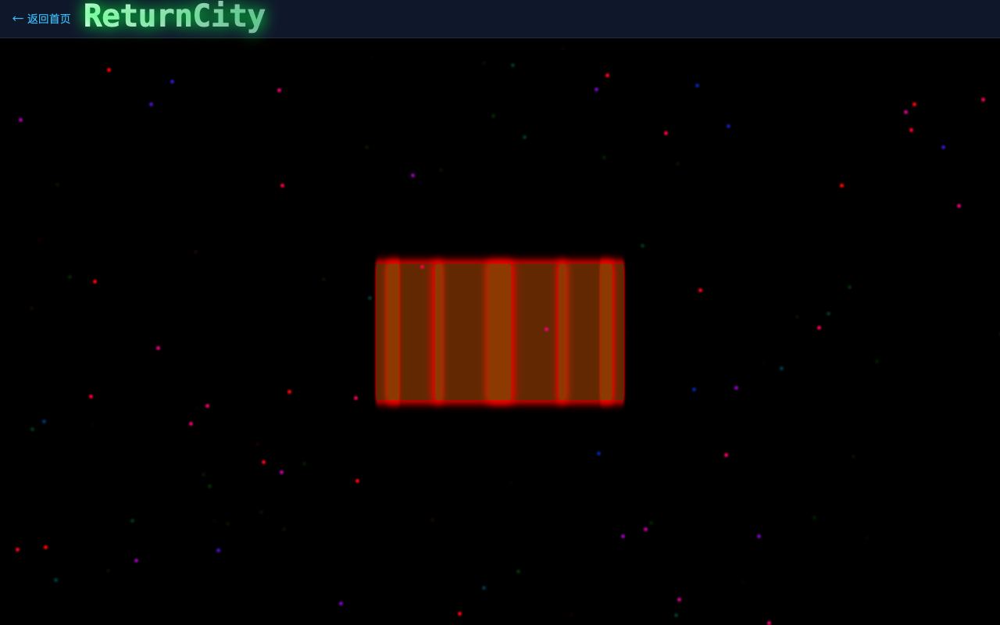

---

### 4. Turntable — 抽奖转盘

这是目前库里交互最完整的组件之一。相比一开始的“时钟式 Demo”，它现在已经是一个真正可用的抽奖转盘。

支持能力包括：

- 自定义奖品
- 自定义颜色
- 控制旋转时长
- 控制旋转圈数
- 抽奖结束回调

```tsx
<Turntable
  prizes={[{ label: '一等奖', color: '#FF6B6B' }, { label: '谢谢参与' }]}
  spinDuration={4000}
  onSpinEnd={(prize, index) => alert(prize.label)}
/>
```

| 属性           | 类型                     | 默认值       | 说明           |
| -------------- | ------------------------ | ------------ | -------------- |
| `prizes`       | `TurntablePrize[]`       | 6 个默认奖品 | 奖品列表       |
| `size`         | `number`                 | `360`        | 转盘直径       |
| `spinDuration` | `number`                 | `4000`       | 旋转时长（ms） |
| `spinRounds`   | `number`                 | `5`          | 旋转圈数       |
| `buttonText`   | `string`                 | `'开始抽奖'` | 按钮文案       |
| `onSpinEnd`    | `(prize, index) => void` | -            | 抽奖结束回调   |

**使用建议：**

- 抽奖页建议将业务中奖逻辑和 UI 演示逻辑分开
- 若接真实抽奖接口，推荐由服务端返回中奖索引，再控制最终停留结果
- 当前默认更适合前台互动展示、活动页、内部 Demo

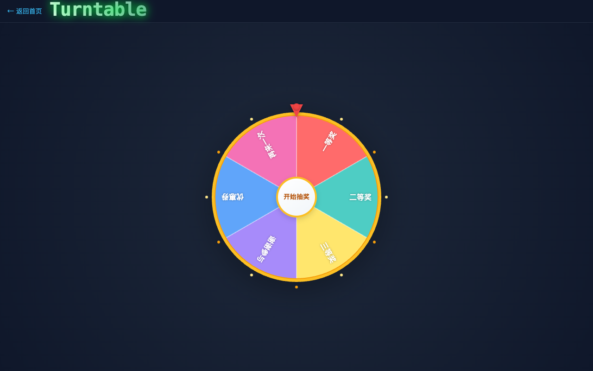

---

### 5. Fireworks — 烟花特效

`Fireworks` 是一个非常适合“成功反馈”的组件。点击画布就能燃放烟花，也可以配置自动播放。

适用场景：

- 抽奖成功
- 支付成功
- 活动开始 / 活动达成
- 节日祝福页面

```tsx
<Fireworks width={800} height={500} auto />
```

| 属性     | 类型      | 默认值 | 说明         |
| -------- | --------- | ------ | ------------ |
| `width`  | `number`  | `800`  | 画布宽度     |
| `height` | `number`  | `500`  | 画布高度     |
| `auto`   | `boolean` | `true` | 是否自动燃放 |

**使用建议：**

- 成功态建议只短时间播放，避免长时间持续造成视觉疲劳
- 可与 `Turntable` 联动：中奖后展示烟花
- 若页面已有大量动态背景，烟花应只在关键节点触发

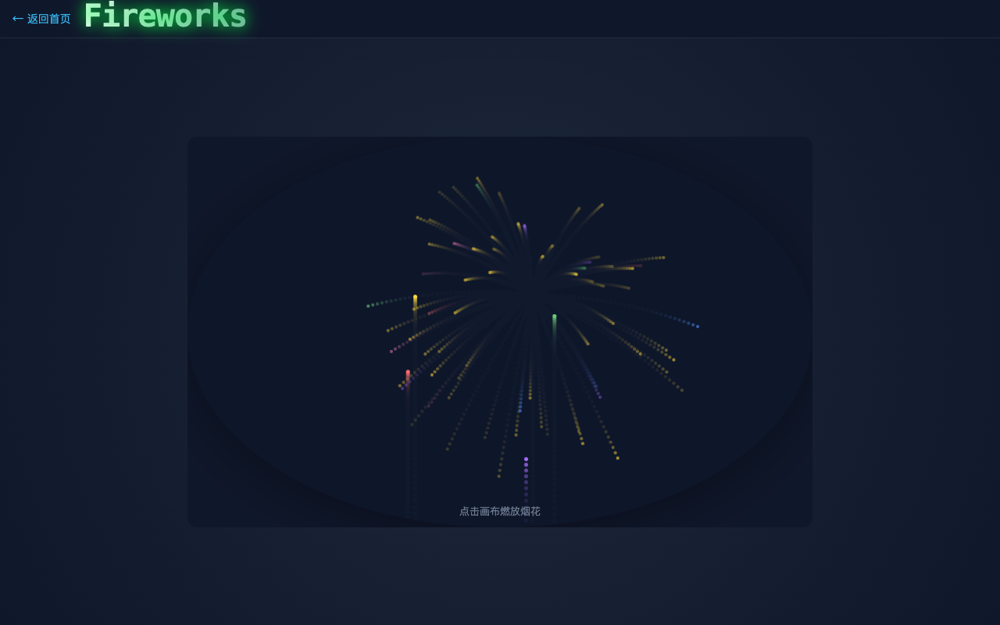

---

### 6. MatrixRain — 黑客帝国数字雨

这是一个非常经典的视觉意象组件。相比烟花这种“事件型”动画，数字雨更适合作为**持续背景层**存在。

```tsx
<MatrixRain width={800} height={500} color="#00ff41" />
```

| 属性      | 类型     | 默认值      | 说明          |
| --------- | -------- | ----------- | ------------- |
| `width`   | `number` | `800`       | 宽度          |
| `height`  | `number` | `500`       | 高度          |
| `density` | `number` | `0.6`       | 列密度（0~1） |
| `color`   | `string` | `'#00ff41'` | 字符颜色      |

**适合的页面：**

- 安全攻防主题页
- 科技主题品牌页
- 终端 / 命令行视觉包装

**使用建议：**

- 建议把它放在标题或 Hero 背景层
- 上层文字最好保持高对比度、居中和简短
- 若是移动端，建议适当降低 density

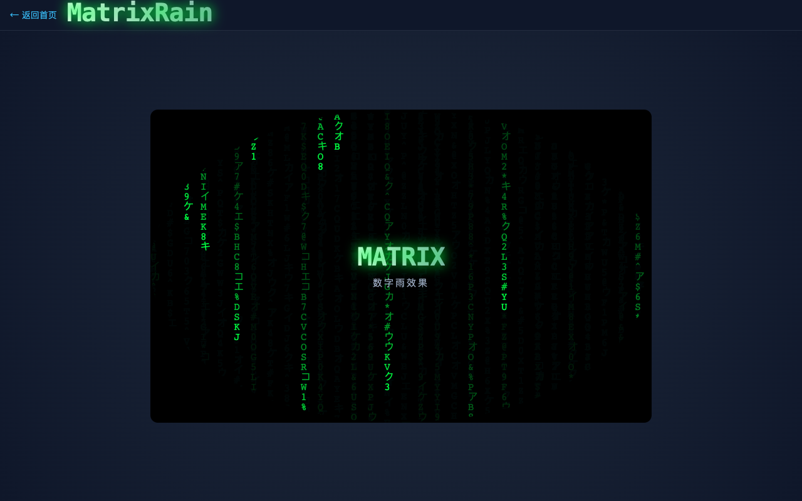

---

### 7. ParticleNetwork — 粒子网络

粒子网络是非常典型的“科技风背景组件”。粒子之间自动连线，鼠标靠近时会产生排斥互动，适合制造“系统正在运行”的感觉。

```tsx
<ParticleNetwork width={800} height={500} particleCount={60} />
```

| 属性            | 类型     | 默认值      | 说明     |
| --------------- | -------- | ----------- | -------- |
| `width`         | `number` | `800`       | 宽度     |
| `height`        | `number` | `500`       | 高度     |
| `particleCount` | `number` | `60`        | 粒子数量 |
| `linkDistance`  | `number` | `120`       | 连线距离 |
| `color`         | `string` | `'#38bdf8'` | 粒子颜色 |

**使用建议：**

- 非常适合用作 Landing Page 背景
- 若作为背景层，前景内容建议控制在 1~2 个主视觉元素内
- 粒子数量不是越多越好，适当留白更有呼吸感

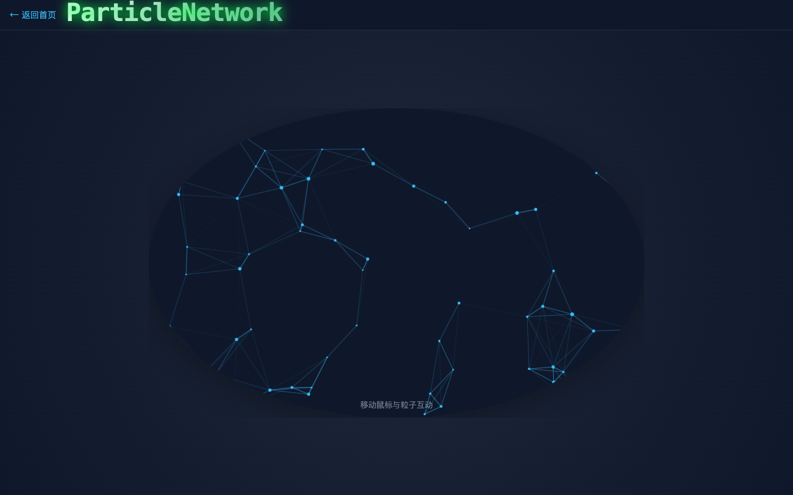

---

### 8. Typewriter — 打字机

这是一个相对轻量但很实用的文字动画组件。终端风格的排版与逐字输出效果，天然适合：

- 开场介绍语
- 黑客风标题区
- AI / CLI / 开发者工具介绍页

```tsx
<Typewriter texts={['Hello, cos-design!', '欢迎体验 ✨']} speed={100} pause={2000} />
```

| 属性          | 类型       | 默认值       | 说明                 |
| ------------- | ---------- | ------------ | -------------------- |
| `texts`       | `string[]` | 3 条默认文案 | 轮播文案             |
| `speed`       | `number`   | `100`        | 打字速度（ms/字符）  |
| `deleteSpeed` | `number`   | `50`         | 删除速度（ms/字符）  |
| `pause`       | `number`   | `2000`       | 完整展示后停顿（ms） |

**使用建议：**

- 文案不要太长，最好控制在一行或两行内
- 英文、短句、标语类文本效果最佳
- 可与 `MatrixRain` 组合，形成完整赛博风首页

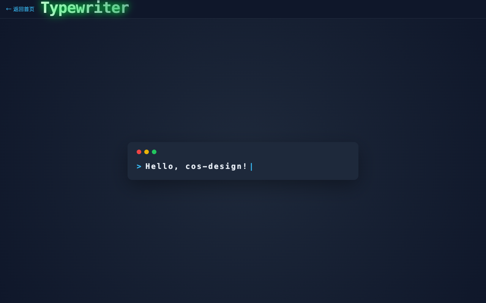

---

### 9. NeonText — 霓虹灯文字

如果你想做一个“赛博朋克标题”，这个组件基本就是现成答案。霓虹文字发光、闪烁、反射效果都已经内置好了。

```tsx
<NeonText text="COS" color="#00ffff" fontSize={72} flicker />
```

| 属性       | 类型      | 默认值      | 说明     |
| ---------- | --------- | ----------- | -------- |
| `text`     | `string`  | `'NEON'`    | 显示文字 |
| `color`    | `string`  | `'#ff00de'` | 霓虹主色 |
| `fontSize` | `number`  | `72`        | 字号     |
| `flicker`  | `boolean` | `true`      | 是否闪烁 |

**使用建议：**

- 字数建议短一些，1~6 个字符效果最佳
- 用于标题、品牌名称、口号时最有冲击力
- 与暗背景搭配时效果最好

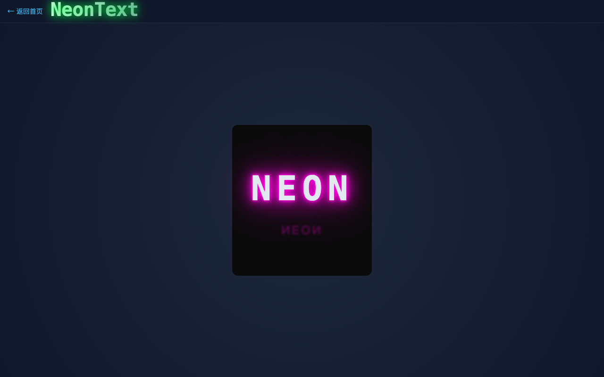

---

### 10. WaveButton — 波纹按钮

这是一个更贴近业务落地的组件。它不像前面那些组件那么“舞台化”，但在 CTA 按钮、引导按钮、活动按钮中很有表现力。

```tsx
<WaveButton text="点我试试" color="#38bdf8" onClick={() => alert('clicked')} />
```

| 属性      | 类型         | 默认值       | 说明     |
| --------- | ------------ | ------------ | -------- |
| `text`    | `string`     | `'点我试试'` | 按钮文字 |
| `color`   | `string`     | `'#38bdf8'`  | 主色     |
| `onClick` | `() => void` | -            | 点击回调 |

**使用建议：**

- 很适合作为 Hero 区主按钮
- 可搭配 `Fireworks` 或 `Turntable` 形成“点击触发反馈”的完整交互链路
- CTA 文案建议直接、短小、有指向性

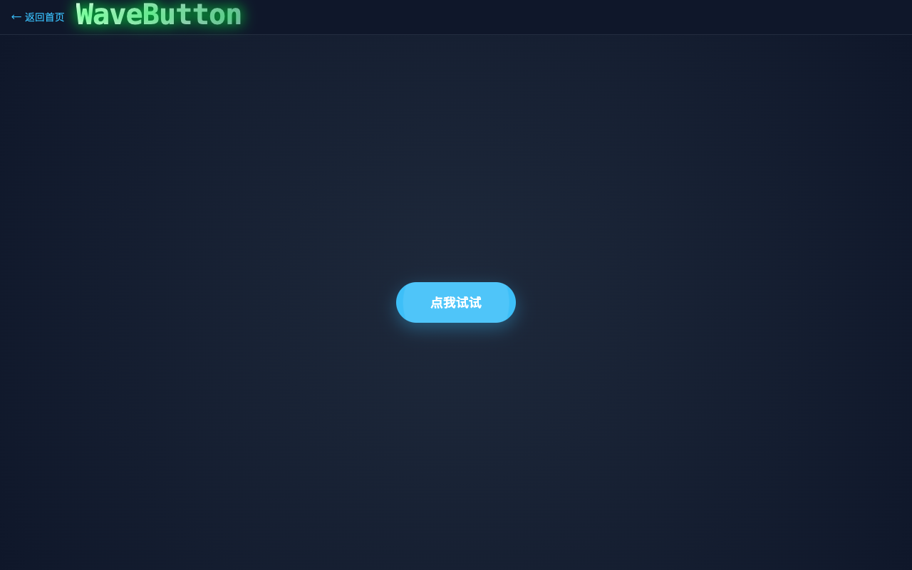

---

## 九、如何做组件选型？

如果你第一次接触这个库，可能会问：这么多特效组件，我该选哪个？

这里给一个简单的选型建议：

### 想做“背景氛围”

优先选：

- `MatrixRain`
- `ParticleNetwork`
- `ReturnCity`

### 想做“事件反馈”

优先选：

- `Fireworks`
- `Turntable`
- `Charge`

### 想做“标题视觉”

优先选：

- `NeonText`
- `Typewriter`

### 想做“交互引导”

优先选：

- `WaveButton`
- `Turntable`

---

## 十、当前项目的工程规则

除了使用规则之外，当前仓库本身也有一套比较清晰的工程规范。

### 1. 组件组织规则

- 每个组件一个独立目录
- 入口文件为 `index.tsx`
- 样式文件统一为 `style/index.module.less`
- Props 接口在组件文件内导出

### 2. 导出规则

所有对外能力统一通过 `src/components/index.tsx` 暴露，业务侧不应该直接 import 深层路径。

推荐：

```tsx
import { Fireworks } from 'cos-design';
```

不推荐：

```tsx
import Fireworks from 'cos-design/src/components/fireworks';
```

### 3. 样式规则

- 使用 CSS Modules，避免类名污染
- Less 负责组织嵌套样式
- 特效类组件优先将视觉参数收敛为 Props，而不是依赖业务层 CSS 覆盖

### 4. 发布规则

- 每次发版前更新 `package.json` 中的 `version`
- 同步更新 `CHANGELOG.md`
- Push 到 `master` 后，CI / Release 自动执行

---

## 十一、构建、发布与 CI/CD

项目已经配置 GitHub Actions 自动化流程：

- **CI**：每次 Push / PR 自动执行 `lint` + `build`
- **Release**：Push 到 `master` 后，若 npm 不存在当前版本，则自动发布

### 发布一个新版本的最小流程

```bash
# 1. 修改版本号
# 2. 更新 CHANGELOG.md
git add .
git commit -m "chore: release v2.3.0"
git push origin master
```

### 当前版本演进概览

从变更记录可以看到几个关键节点：

- **v2.0.0**：迁移到 Vite、升级 React 18、接入开源规范
- **v2.1.0**：新增 6 个视觉组件，加入 Playground 导航
- **v2.2.0**：升级到 React 19、Vite 8、ESLint 9 flat config

也就是说，这个项目不是静态停在某个 Demo 阶段，而是在持续往“可维护的视觉组件库”方向演进。

---

## 十二、还有哪些可以继续做？

如果继续演进，我认为这个项目还有几个很值得补强的方向：

### 1. 更强的组件控制能力

例如：

- `Charge` 支持受控进度
- `Fireworks` 支持手动触发 API
- `ReturnCity` 支持颜色和粒子数量配置

### 2. 统一的主题系统

目前很多组件都内置了自己的颜色方案。后续可以考虑统一主题变量，如：

- 主色
- 背景色
- 发光色
- 粒子色

### 3. 更完善的文档站

现在项目已经有 Playground，但还可以继续补：

- 在线 Props 文档
- 复制即用示例
- 场景案例页
- 性能说明

### 4. 更多“业务友好型”特效组件

比如：

- 数字翻牌器
- 倒计时卡片
- 粒子按钮
- 徽章/奖杯展示组件
- 结果揭晓动画组件

---

## 十三、总结

**cos-design** 从一个早期的视觉 Demo 集合，已经演化成了一个具备如下特征的现代 React 组件库：

- 基于 **React 19 + Vite 8 + TypeScript 5**
- 覆盖 **10 个**视觉型组件
- 支持 **ESM / CJS / TypeScript 类型**
- 内置 **Playground**、**CI**、**自动发布**
- 适合活动页、展示页、品牌页和创意项目

如果你的页面需要的不只是“能用”，还希望多一点“氛围感”“科技感”“记忆点”，那这类组件库确实会很有价值。

如果你想快速试一下，只需要：

```bash
pnpm add cos-design
```

然后从一个你最喜欢的组件开始，比如：

- 想做标题效果，就试试 `NeonText`
- 想做动态背景，就试试 `ParticleNetwork`
- 想做活动抽奖，就试试 `Turntable`
- 想做庆祝反馈，就试试 `Fireworks`

欢迎 Star、Issue 和 PR：  
[github.com/jiaxiantao/cos-design](https://github.com/jiaxiantao/cos-design)

---

_本文档由项目源码、本地 Playground 截图与当前工程配置整理生成，图片均存放于 `website-content/images/`。_
